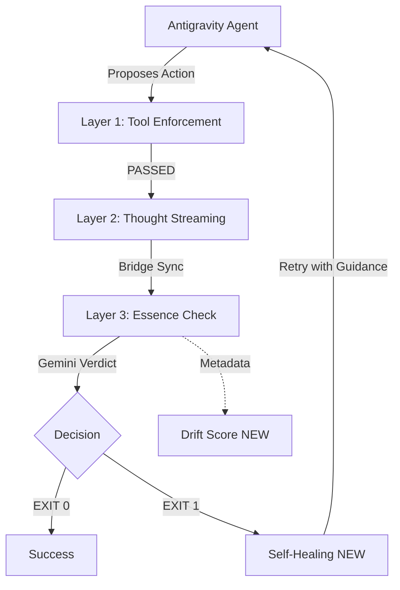

# 📊 Phase 2: Pattern Analysis & Decision Matrix

## 🎯 Cilj Analize

Mapirati otkrivene šablone iz Phase 1 na trenutnu JudgeGuard arhitekturu i identifikovati prioritetne poboljšanja.

---

## 🔍 Mapiranje Pattern → JudgeGuard

### 1. Recursive Constitutional AI (CAI)

**Status:** ✅ **VEĆ IMPLEMENTIRANO**

JudgeGuard **JE** implementacija Recursive CAI:

- **Actor:** Antigravity Agent (predlaže akcije)
- **Judge:** JudgeGuard Layer 3 (Essence Check koristi Gemini da pregleda akciju)
- **Constitution:** `PROJECT_ESSENCE` (pravila zakodirane u Python kodu)

**Dokaz:** `judge_guard.py:43-56` - PROJECT_ESSENCE definiše "ustav".

---

### 2. Agentic Drift Detection

**Status:** ⚠️ **DELIMIČNO IMPLEMENTIRANO**

JudgeGuard **detektuje** drift (Layer 3 proverava semantičku usklađenost), ali **nema numericku metriku**.

**Gap:** Nedostaje `drift_score` (0.0-1.0) koji bi dao preciznu indikaciju koliko je agent "zalutao".

**Predlog:**

```python
def calculate_drift_score(action: str, essence: str) -> float:
    # Koristi embedding similarity (cosine) između akcije i PROJECT_ESSENCE
    # 0.0 = Perfektna usklađenost, 1.0 = Totalni drift
    pass
```

---

### 3. Self-Healing Loop

**Status:** ❌ **NIJE IMPLEMENTIRANO**

Trenutno: Ako Layer 3 vrati `EXIT 1`, sistem se ZAUSTAVLJA.
Problem: Agent nema automatsku petlju za samokorekciju.

**Predlog:**
Dodati `retry_with_guidance()` funkciju koja vraća specifičan razlog odbijanja i omogućava agentu da revidira plan.

---

### 4. Chain of Verification (CoVe)

**Status:** ❌ **NIJE IMPLEMENTIRANO**

JudgeGuard radi "single-pass" proveru. CoVe zahteva **4-step process**:

1. Draft Action
2. Extract Claims
3. Verify Claims Independently
4. Final Synthesis

**Predlog:** Uvesti Layer 4 za multi-step verifikaciju kritičnih akcija (deployment, schema changes).

---

### 5. Supervisor-Worker Pattern

**Status:** ⚠️ **NE PRIMENJIVO DIREKTNO**

Supervisor pattern je za **orkestraciju taskova**, a JudgeGuard je **validator**.
Ali: Moguće je koristiti ovaj pattern za **hijerarhijsku verifikaciju** (npr. jedna proveravska instanca za sintaksu, druga za semantiku).

### 6. Browser Chain of Truth (CoT) Loop

**Status:** ❌ **NIJE IMPLEMENTIRANO**

Trenutno: Agenti rade u browseru sa bazičnim "reasoning" ciklusom. JudgeGuard ne proverava visual/DOM truth između koraka.

**Gap:** Nedostatak determinističkog "anchoring" mehanizma koji sprečava agenta da "misli" da je kliknuo na element koji je zapravo blokiran ili nevidljiv.

**Predlog:** Uvesti `Stage 5: Verification` u browser workflow koji radi DOM diffing.

---

### 7. State Anchoring (Semantic Anchoring)

**Status:** ❌ **NIJE IMPLEMENTIRANO**

**Gap:** Brittle CSS selectors.

**Predlog:** Mehanizam koji identifikuje stabilne atribute (h1 text, URL, data-attributes) pre izvršavanja akcije.

---

### 8. Ground Truth Manifest (Context Memento)

**Status:** ❌ **NIJE IMPLEMENTIRANO**

**Gap:** Agent "zaboravlja" restrikcije tokom dugih sesija (context rot).

**Predlog:** `memento` fajl (read-only) koji se re-injectuje u svaki prompt, osiguravajući da su "rules of engagement" uvek prisutna.

---

## 📋 Decision Matrix

| Pattern                   | Prioritet | Implementabilnost | Impact (1-10) | Napomena                                     |
| :------------------------ | :-------- | :---------------- | :------------ | :------------------------------------------- |
| Drift Score Metric        | 🔥 HIGH   | ⭐️⭐️⭐️⭐️⭐️        | 9/10          | Jednostavno, odmah korisno                   |
| Self-Healing Loop         | 🔥 HIGH   | ⭐️⭐️⭐️⭐️          | 8/10          | Zahteva pažljivu implementaciju retry logike |
| Browser CoT Verification  | 🔥 HIGH   | ⭐️⭐️⭐️            | 10/10         | Kritično za pouzdano korišćenje alata        |
| Ground Truth Manifest     | 🟡 MEDIUM | ⭐️⭐️⭐️⭐️⭐️        | 7/10          | Lako za implementaciju, visok security gain  |
| CoVe (Multi-Step Verify)  | 🟡 MEDIUM | ⭐️⭐️⭐️            | 7/10          | Kompleksno, ali moćno za kritične akcije     |
| Hierarchical Verification | 🟢 LOW    | ⭐️⭐️              | 5/10          | Overkill za trenutni scope                   |

---

## 🚀 Akcioni Plan (Prioritet Order)

### Faza A: Quick Wins (1-2 dana)

1. **Drift Score:** Dodati numeričku metriku u Layer 3 output.
2. **Enhanced Logging:** Logovanje razloga odbijanja (verboznije objašnjenje zašto je akcija blokirana).

### Faza B: Core Improvements (3-5 dana)

1. **Self-Healing Loop:** Implementirati `retry_with_context()` mehanizam.
2. **Test Suite:** Kreirati test case-ove za drift detection.

### Faza C: Advanced Features (Opciono, 1-2 nedelje)

1. **CoVe Layer:** Dodati Layer 4 za chain-of-verification na deployment akcije.

---

## 🔗 Veza sa Postojećom Arhitekturom



---

> **Status:** Phase 2 Analysis Complete. Ready for Validation.
